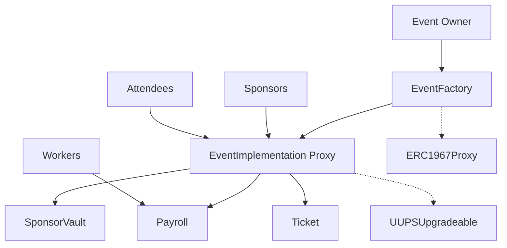

# Decentralized Event Ticketing Platform

[](https://getfoundry.sh/)
[](https://soliditylang.org/)
[](https://opensource.org/licenses/MIT)

A comprehensive smart contract architecture for decentralized event management, featuring sponsorship funding, multi-tier ticketing, and automated payroll distribution. Built with upgradeable proxy patterns for maximum flexibility and security.

## Overview

This platform revolutionizes event management by providing a fully decentralized, transparent, and automated system where:

- **Event organizers** can create and manage events with customizable funding goals and ticket tiers
- **Sponsors** can contribute to event funding and receive proportional revenue shares
- **Attendees** can purchase tickets from multiple price tiers with supply limits
- **Workers** receive automated payroll disbursements post-event
- **All stakeholders** benefit from on-chain transparency and trustless execution

## Architecture

### Core Components

```
┌─────────────────────────────────────────────────────────────────┐
│                    Event Factory Pattern                        │
│  ┌─────────────────────────────────────────────────────────┐    │
│  │                EventFactory Contract                    │    │
│  │  • Deploys upgradeable proxy contracts                  │    │
│  │  • Manages event ownership mapping                      │    │
│  │  • Handles access control for deployment               │    │
│  └─────────────────────────────────────────────────────────┘    │
└─────────────────────────────────────────────────────────────────┘
                                    │
                                    ▼
┌─────────────────────────────────────────────────────────────────┐
│                  Event Proxy Instance                          │
│  ┌─────────────────────────────────────────────────────────┐    │
│  │            EventImplementation Contract                │    │
│  │  • Core event logic and state management               │    │
│  │  • Multi-tier ticketing system                         │    │
│  │  • Revenue distribution orchestration                  │    │
│  └─────────────────────────────────────────────────────────┘    │
│                                                                 │
│  ┌─────────────────────────────────────────────────────────┐    │
│  │              Supporting Contracts                       │    │
│  │  ┌─────────────┐ ┌─────────────┐ ┌─────────────┐        │    │
│  │  │SponsorVault │ │   Payroll   │ │   Ticket    │        │    │
│  │  │• Deposit    │ │• Worker     │ │• ERC721     │        │    │
│  │  │ accounting  │ │ payments    │ │ tickets     │        │    │
│  │  └─────────────┘ └─────────────┘ └─────────────┘        │    │
│  └─────────────────────────────────────────────────────────┘    │
└─────────────────────────────────────────────────────────────────┘
```

### Contract Relationships



## Smart Contracts

### EventFactory
**Location:** `src/contract/EventFactory.sol`

The factory contract responsible for deploying new event instances using the upgradeable proxy pattern.

**Key Features:**
- Deploys ERC1967 proxies for each event
- Maps event owners to their deployed contracts
- Implements access control for authorized deployers
- Handles event metadata and initialization

**Functions:**
- `createEvent()` - Deploys new event proxy with custom parameters
- `authorizeDeployer()` - Grants deployment permissions
- `getOwnerEvents()` - Retrieves events owned by an address

### EventImplementation
**Location:** `src/contract/EventImplementation.sol`

The core contract containing all event logic, deployed as an upgradeable proxy for each event.

**Key Features:**
- Multi-tier ticketing with supply limits
- Sponsor deposit management with funding goals
- Automated revenue distribution
- Emergency pause functionality
- Event lifecycle management

**Functions:**
- `deposit()` - Sponsor contributions
- `purchaseTicket()` - Ticket sales with tier validation
- `endEvent()` - Triggers revenue distribution
- `withdrawDeposit()` - Pre-event deposit withdrawals

### SponsorVault
**Location:** `src/contract/SponsorVault.sol`

Manages sponsor deposits and calculates proportional revenue shares.

**Key Features:**
- Tracks sponsor contributions per event
- Calculates percentage shares in basis points
- Handles revenue distribution post-event
- Supports deposit withdrawals and refunds

**Functions:**
- `deposit()` - Records sponsor contributions
- `distributeRevenue()` - Pays sponsors proportionally
- `withdrawDeposit()` - Allows pre-event withdrawals
- `refundAllSponsors()` - Full refund on event cancellation

### Payroll
**Location:** `src/contract/Payroll.sol`

Manages worker registration and automated payment distribution.

**Key Features:**
- Worker salary registration and updates
- Batch payment processing
- ERC20 token integration
- Reentrancy protection

**Functions:**
- `addWorkerToPayroll()` - Registers workers with salaries
- `payWorkers()` - Distributes payments to all workers
- `updateWorkerSalary()` - Modifies worker compensation
- `getWorkerInfo()` - Retrieves worker details

### Ticket
**Location:** `src/contract/Ticket.sol`

ERC721-based ticket contract for event attendance.

**Key Features:**
- Standard ERC721 implementation
- Event-specific ticket metadata
- Tier and pricing information storage
- Ticket refund functionality

**Functions:**
- `mintWithDetails()` - Creates tickets with event data
- `refundTicket()` - Burns and refunds tickets
- `getTicketInfo()` - Retrieves ticket metadata

## 🔧 Technical Specifications

### Prerequisites
- **Solidity:** ^0.8.20
- **Foundry:** Latest version
- **OpenZeppelin Contracts:** Latest version

### Dependencies
```toml
[dependencies]
"@openzeppelin/contracts" = "5.0.0"
"@openzeppelin/contracts-upgradeable" = "5.0.0"
```

### Installation
```bash
# Clone the repository
git clone <repository-url>
cd decentralized-event-ticketing

# Install dependencies
forge install

# Run tests
forge test

# Build contracts
forge build
```

### Deployment
```bash
# Deploy SponsorVault
forge script script/DeploySponsorVault.s.sol --rpc-url <rpc-url> --private-key <private-key>

# Deploy EventFactory
forge script script/DeployEventFactory.s.sol --rpc-url <rpc-url> --private-key <private-key>

# Create an event
forge script script/CreateEvent.s.sol --rpc-url <rpc-url> --private-key <private-key>
```

## Usage Examples

### Creating an Event
```solidity
// Define ticket tiers
EventImplementation.TicketTier[] memory tiers = new EventImplementation.TicketTier[](3);
tiers[0] = EventImplementation.TicketTier("VIP", 2 ether, 50, 0);
tiers[1] = EventImplementation.TicketTier("General", 1 ether, 200, 0);
tiers[2] = EventImplementation.TicketTier("Student", 0.5 ether, 100, 0);

// Create event via factory
address eventAddress = factory.createEvent(
    50 ether,        // fundingGoal
    startTime,       // startTime
    endTime,         // endTime
    "Music Festival", // eventName
    "Annual music event", // description
    ticketAddress,   // ticketContract
    payrollAddress,  // payrollContract
    tokenAddress,    // paymentToken
    tiers           // ticketTiers
);
```

### Sponsor Deposit
```solidity
// Approve token spending
IERC20(token).approve(eventAddress, depositAmount);

// Deposit as sponsor
EventImplementation(eventAddress).deposit(depositAmount);
```

### Ticket Purchase
```solidity
// Approve token spending
IERC20(token).approve(eventAddress, ticketPrice);

// Purchase VIP ticket (tier 0)
EventImplementation(eventAddress).purchaseTicket(0);
```

## 🧪 Testing

The project includes comprehensive test coverage with 26 passing tests.

### Test Structure
```
test/
├── EventFactory.t.sol      # Factory contract tests
├── EventImplementation.t.sol # Core logic tests
└── Payroll.t.sol          # Payroll contract tests
```

### Running Tests
```bash
# Run all tests
forge test

# Run specific test file
forge test --match-path test/EventImplementation.t.sol

# Run with gas reporting
forge test --gas-report

# Run with coverage
forge coverage
```

### Test Coverage Areas
- ✅ Event creation and initialization
- ✅ Sponsor deposits and funding goals
- ✅ Multi-tier ticket purchasing
- ✅ Revenue distribution
- ✅ Access control and authorization
- ✅ Emergency pause functionality
- ✅ Event lifecycle management

## Gas Analysis

### Contract Sizes
| Contract | Runtime Size | Initcode Size | Runtime Margin | Initcode Margin |
|----------|-------------|---------------|----------------|-----------------|
| EventFactory | 8,059 B | 8,978 B | 16,517 B | 40,174 B |
| EventImplementation | 19,465 B | 20,187 B | 5,111 B | 28,965 B |
| SponsorVault | 7,051 B | 7,643 B | 17,525 B | 41,509 B |
| Payroll | 7,720 B | 8,312 B | 16,856 B | 40,840 B |
| Ticket | 10,503 B | 11,966 B | 14,073 B | 37,186 B |

### Key Function Gas Costs
- **createEvent:** ~707K gas (median)
- **deposit:** ~173K gas (median)
- **purchaseTicket:** ~189K gas (median)
- **endEvent:** ~14K gas (median)

## 🔒 Security Features

### Upgradeable Contracts
- **UUPS Pattern:** Decentralized upgrades controlled by event owners
- **Storage Layout:** Consistent variable ordering prevents storage collisions
- **Initialization:** Protected against re-initialization attacks

### Access Control
- **Ownable:** Event owners control their events
- **Authorized Deployers:** Factory restricts who can create events
- **Contract Isolation:** Each event is a separate proxy instance

### Economic Security
- **Reentrancy Guards:** All state-changing functions protected
- **Pull Payments:** Sponsors withdraw funds rather than automatic transfers
- **Minimum Deposits:** Prevents dust transactions

### Emergency Controls
- **Pause Functionality:** Owners can pause events in emergencies
- **Deposit Withdrawals:** Sponsors can withdraw before event starts
- **Event Cancellation:** Full refunds on cancelled events

## Future Enhancements

### Planned Features
- **Cross-chain Events:** Multi-chain event management
- **Dynamic Pricing:** Automated price adjustments based on demand
- **NFT Tickets:** Enhanced ticket metadata and transferability
- **Governance:** Community-driven platform parameters
- **Analytics:** On-chain event performance metrics

### Protocol Improvements
- **Layer 2 Support:** Optimistic rollup integration
- **Gas Optimization:** Further bytecode size reduction
- **Batch Operations:** Multi-ticket purchases and bulk payments
- **Oracle Integration:** Real-world event verification

## Contributing

We welcome contributions to improve the platform! Please follow these steps:

1. Fork the repository
2. Create a feature branch (`git checkout -b feature/amazing-feature`)
3. Commit your changes (`git commit -m 'Add amazing feature'`)
4. Push to the branch (`git push origin feature/amazing-feature`)
5. Open a Pull Request

### Development Guidelines
- Follow Solidity style guide
- Add comprehensive tests for new features
- Update documentation
- Ensure gas efficiency
- Maintain upgrade compatibility

## License

This project is licensed under the MIT License - see the [LICENSE](LICENSE) file for details.

## Support

For questions, issues, or contributions:
- Open an issue on GitHub
- Join our Discord community
- Check the documentation

## Acknowledgments

- **OpenZeppelin** for secure, audited smart contract libraries
- **Foundry** for the excellent development framework
- **Ethereum Community** for ongoing innovation in decentralized systems

---
